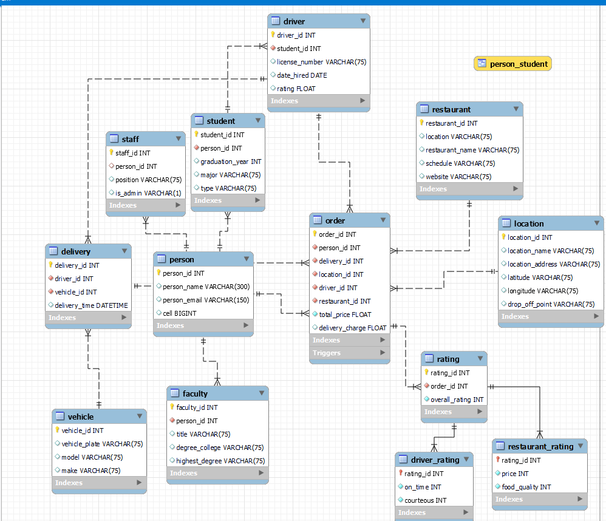

# database-project-repo
### Data Dragons

## Landen Johnson & Jose Martinez

## With the threat of the Corona virus, food delivery services are more important than ever.  Local restaurants are eager to find easy ways to have food delivered to customers without having to hire delivery employees. Even when things return to normal, many experts feel that food delivery will be something that we all will have become accustomed to as a part of our regular activites (even more than before). Students love food delivery services, however, campuses do not like the steady stream of visitors that may or  may not have a formal connection with the university. Many schools are wondering if they should take control of the delivery and ensure that students and authorized university employees are the only ones delivering food on campus for safety and health reasons. Our solution to this problem is Campus Eats.

## Business rule: Only approved campus locations will be added to the database. Locations include; dorms, student center, approved classroom buildings, Admin circle.
## Business rule: Designated drivers include: only students.
## Business rule: Vehicles are registered to students and have to be up to date on licence and insurance information.
## Business rule: Fees: $5 flat rate fee
## Business rule: Student-to-order relationship: A person orders food one to many times.  An individual delivery is tied to one and only one person for the order.  The order is for one and only one restaurant.
## Business rule: Ratings: ratings can include an overall rating, driver rating. Ratings are not required.

## EERD:
  

## Max, Min, Avg Rating of Restuarant:

## Max, Min, Avg Rating of Delivery Driver:

## Amount of Deliveries Made by Driver in 2021

## Amount of Order Made by A Customer in 2021

## Number of Deliveries by Driver in View

## Stored Procedures

## Future Work
